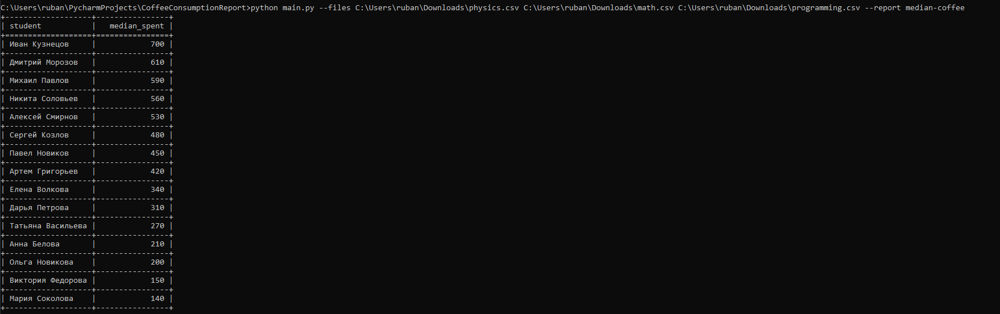
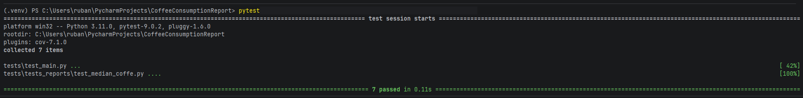

# ✨ Отчет о потреблении кофе

Отчет median-coffee реализован в [median_coffee.py](Reports/median_coffee.py) в виде класса MedianCoffee
 Проверку валидности оставил в main.

## Добавление новых отчетов
1. Создать новый файл с классом нового отчета в директории Reports, по примеру median_coffee;
2. Добавить в файл [reportlist.py](config/reportlist.py) в словарь reportList имя и ссылку на класс отчета;
 2.1. Если нужно углубить структуру в Reports, разделив отчеты по отдельным директориям, необходимо во всех новых директориях добавить __init__.py и в reportlist.py добавить подключения соответствующего модуля. 

## Пример запуска скрипта

## Тесты

